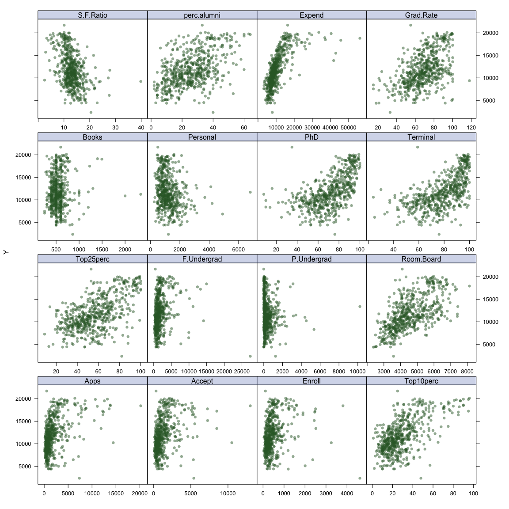
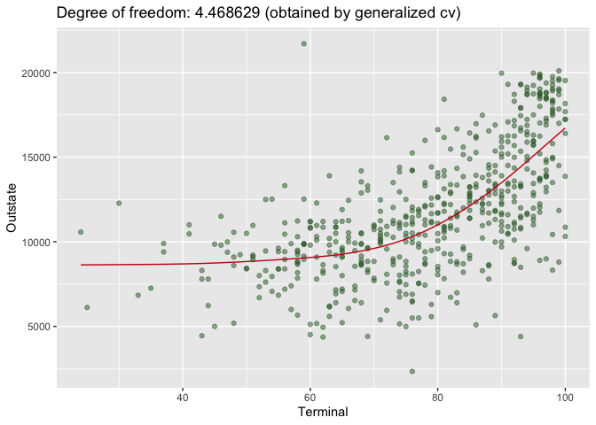
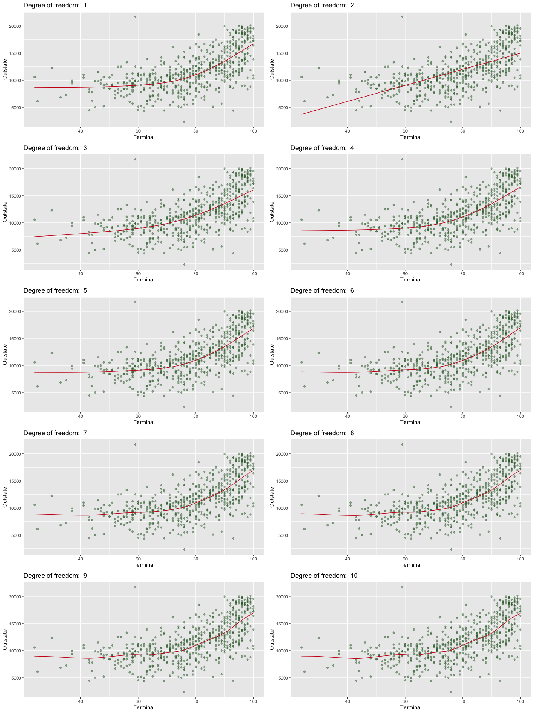
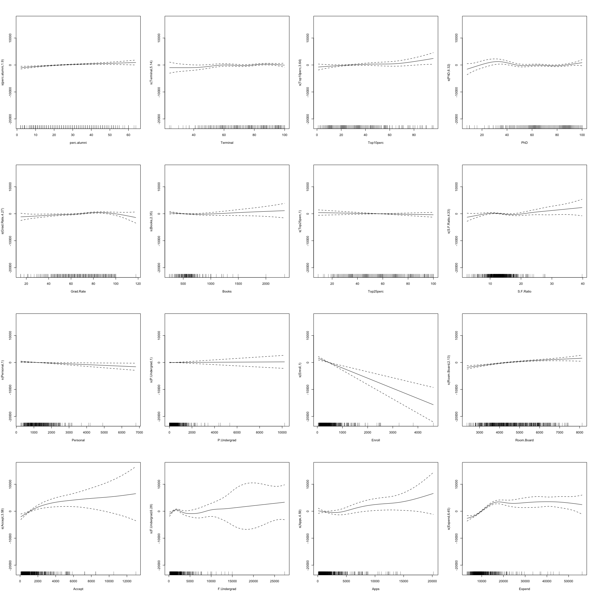
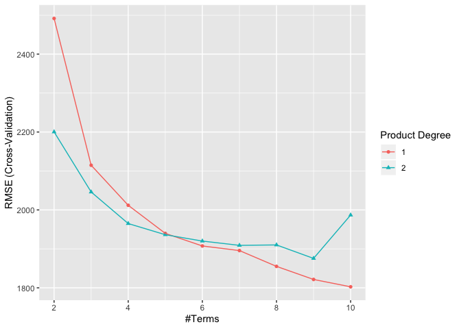
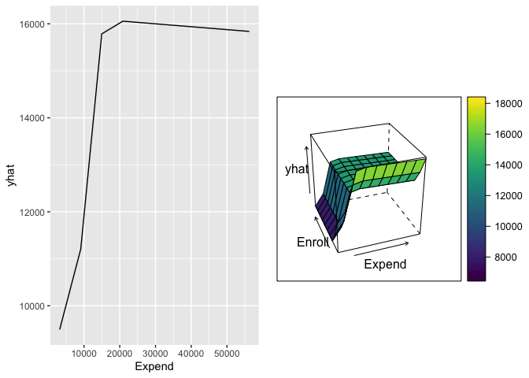

P8106\_hw2\_xh2395
================
Xin He
3/19/2020

## Homework 2 Description

In this exercise, we build nonlinear models using the “College” data.
The dataset contains statistics for 565 US Colleges from the 1995 issue
of US News and World Report. The response variable is the out-of-state
tuition (Outstate). In what follows, use the data excluding statistics
for Columbia University (i.e., the 125th observation) to train the
models.

## Import and tidy the data

``` r
#import data
college_c = read_csv("./data/College.csv")

#exclude Columbia University
college_df = college_c %>%  
  filter(College != "Columbia University") %>% 
  select(-College)
```

## Set random seed

``` r
set.seed(2020)
```

## a) Create Scatter Plots

response vs predictors

``` r
# matrix of predictors
x = model.matrix(Outstate ~ .,college_df)[,-1] 
# vector of response
y = college_df$Outstate

featurePlot(x, y, plot = "scatter", labels = c("","Y"), type = c("p"), layout = c(4, 4))
```

<!-- -->

## b) Smoothing Spline Model

Fit a smoothing spline model using Terminal as the only predictor of
Outstate for a range of degrees of freedom, as well as the degree of
freedom obtained by generalized cross- validation, and plot the
resulting fits. Describe the results obtained.

### The degree of freedom obtained by generalized cv

``` r
fit.ss = smooth.spline(college_df$Terminal, college_df$Outstate)
fit.ss$df
```

    ## [1] 4.468629

The degree of freedom obtained by generalized cv is 4.468629.

### Plot the resulting fit

``` r
Terminallims = range(college_df$Terminal)
Terminal.grid = seq(from = Terminallims[1],to = Terminallims[2])

pred.ss = predict(fit.ss,
                   x = Terminal.grid)

pred.ss.df = data.frame(pred = pred.ss$y,
                         Terminal = Terminal.grid)

p_0 = ggplot(data = college_df, aes(x = Terminal, y = Outstate)) +
  geom_point(color = rgb(.2, .4, .2, .5))

p_ss = p_0 + 
  geom_line(aes(x = Terminal, y = pred), data = pred.ss.df,
          color = rgb(.8, .1, .1, 1)) +
  labs(title = "Degree of freedom: 4.468629 (obtained by generalized cv)")

p_ss
```

<!-- -->

### A range of degrees of freedom

``` r
spline = function(degree){
    title = paste("Degree of freedom: ", degree)
    spline = smooth.spline(college_df$Terminal,college_df$Outstate, df = degree)
    pred = predict(spline, x = Terminal.grid)
    df_spine_pre = data.frame(Terminal = Terminal.grid,
                          pred = pred$y)
    
    p = p_0 +
    geom_line(aes(x = Terminal, y = pred),
              data = df_spine_pre,
              color = rgb(.8, .1, .1, 1)
              ) +
    labs(
        title = title
    )
}

p = list()
for (i in 1:10) {
    p[[i]] = spline(i)
}
```

    ## Warning in smooth.spline(college_df$Terminal, college_df$Outstate, df =
    ## degree): not using invalid df; must have 1 < df <= n := #{unique x} = 65

``` r
p[[1]] + p[[2]] + p[[3]] + p[[4]] + p[[5]] +  p[[6]] + p[[7]] + p[[8]] + 
    p[[9]] + p[[10]] +
    plot_layout(ncol = 2, nrow = 5)
```

<!-- -->

**Describe the results obtained:**

The out-of-state tuition is a nonlinear function of Terminal. When we
only use Terminal as a predictor and use the degree of freedom obtained
by generalized cv to fit the data, the fitted curve can be very smoothy.

From the plots we can see that when degree of freedom is bigger than 5
and goes up, the fitted curve is less smoothy.

## c) Generalized Additive Model (GAM)

Fit a generalized additive model (GAM) using all the predictors. Plot
the results and explain your fndings.

### Fit GAM model

``` r
ctrl1 = trainControl(method = "cv", number = 10)

set.seed(2020)

gam.fit = train(x, y,
                 method = "gam",
                 tuneGrid = data.frame(method = "GCV.Cp", 
                                       select = c(TRUE,FALSE)), 
                 trControl = ctrl1)

gam.fit$bestTune
```

    ##   select method
    ## 1  FALSE GCV.Cp

``` r
gam.fit$finalModel
```

    ## 
    ## Family: gaussian 
    ## Link function: identity 
    ## 
    ## Formula:
    ## .outcome ~ s(perc.alumni) + s(Terminal) + s(Top10perc) + s(PhD) + 
    ##     s(Grad.Rate) + s(Books) + s(Top25perc) + s(S.F.Ratio) + s(Personal) + 
    ##     s(P.Undergrad) + s(Enroll) + s(Room.Board) + s(Accept) + 
    ##     s(F.Undergrad) + s(Apps) + s(Expend)
    ## 
    ## Estimated degrees of freedom:
    ## 1.90 5.14 3.64 6.32 4.27 2.35 1.00 
    ## 4.33 1.00 1.00 1.00 2.13 3.58 6.28 
    ## 4.59 6.45  total = 55.98 
    ## 
    ## GCV score: 2761951

According to the MSE of CV, we fit every predictor with smoothing
spline.

``` r
gam = gam(Outstate ~ s(perc.alumni) + s(Terminal) + s(Top10perc) + s(PhD) + 
    s(Grad.Rate) + s(Books) + s(Top25perc) + s(S.F.Ratio) + s(Personal) + 
    s(P.Undergrad) + s(Enroll) + s(Room.Board) + s(Accept) + 
    s(F.Undergrad) + s(Apps) + s(Expend), data = college_df)
```

### Plot the results

``` r
par(mfrow = c(4,4))
plot(gam)
```

<!-- -->

The out-of-state tuition is a nonlinear function of Terminal, Top10perc,
PhD, Grad.Rate, Books, S.F.Ratio, Room.Board, Accept, F.Undergrad, Apps,
Expend, holding other variable fixed. However, the out-of-state is
likely to be a linear function of perc.alumni, Top25perc, Personal,
P.Undergrad, Enroll, holding other variable fixed.

## d) Multivariate Adaptive Regression Spline (MARS)

Fit a multivariate adaptive regression spline (MARS) model using all the
predictors. Report the final model. Present the partial dependence plot
of an arbitrary predictor in your final model.

### Fit MARS model

``` r
mars_grid = expand.grid(degree = 1:2,
                         nprune = 2:10)

set.seed(2020)

mars.fit = train(x, y, 
                  method = "earth",
                  tuneGrid = mars_grid,
                  trControl = ctrl1)

ggplot(mars.fit)
```

<!-- -->

``` r
mars.fit$bestTune
```

    ##   nprune degree
    ## 9     10      1

### Report the final model

``` r
coef(mars.fit$finalModel)
```

    ##         (Intercept)     h(Expend-15365)  h(4450-Room.Board) 
    ##       10856.8275542          -0.7836173          -1.4272043 
    ## h(F.Undergrad-1355) h(1355-F.Undergrad)   h(22-perc.alumni) 
    ##          -0.3818847          -1.6799143        -105.5570689 
    ##        h(Apps-3712)       h(913-Enroll)      h(2193-Accept) 
    ##           0.4334737           4.5019587          -1.9769988 
    ##      h(Expend-6881) 
    ##           0.7774546

### The partial dependence plot (of Expend)

``` r
p1 = partial(mars.fit, pred.var = c("Expend"), grid.resolution = 10) %>% autoplot()

p2 = partial(mars.fit, pred.var = c("Expend", "Enroll"), grid.resolution = 10) %>%
  plotPartial(levelplot = FALSE, zlab = "yhat", drape = TRUE,
              screen = list(z = 20, x = -60))

grid.arrange(p1, p2, ncol = 2)
```

<!-- -->

## e) Predict the out-of-state tuition of Columbia University

Based on the above GAM and MARS models, predict the out-of-state tuition
of Columbia University.

### Predict basing on GAM

``` r
columbia_u = college_c %>% 
  filter(College == "Columbia University")

pred.gam = predict(gam.fit,
                   newdata = columbia_u )

pred.gam
```

    ##        1 
    ## 17728.51

The out-of-state tuition of Columbia University is predicted to be
17728.51 by the above GAM model.

### Predict basing on MARS

``` r
pred.mars = predict(mars.fit,
                    newdata = columbia_u)

pred.mars
```

    ##            y
    ## [1,] 17469.9

The out-of-state tuition of Columbia University is predicted to be
17469.9 by the above MARS model.
